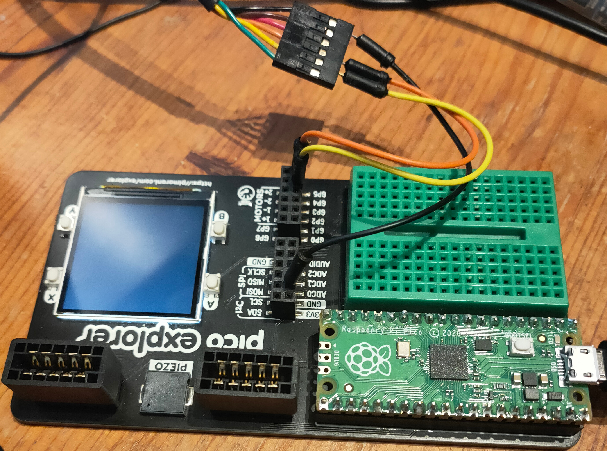

# Using UART1

The Pico has two UARTs for serial communication.

UART0 is dedicated to the MicroPython REPL (Read-Evaluate-Print_loop), but you can use UART1 in your programs.

**Like all the Pico devices, the UARTs should only be used with 3V3 signals.**

I used an [FTDI TTL-232R-3V3](https://www.ftdichip.com/Support/Documents/DataSheets/Cables/DS_TTL-232R_CABLES.pdf)
cable with some jump wires to connect my Linux computer to the Pico.



This code (in src/pico/experiments/uart-test.py) will display 'Hello UART' and then print a line for every character 
you type on the host.


```python
from machine import UART

ser = UART(1, 115200)

ser.write('Hello UART!\r\n')

while True:
    ch = ser.read(1)
    reply = 'I saw %s \r\n' % ch
    ser.write(reply)
    print(reply)

```

