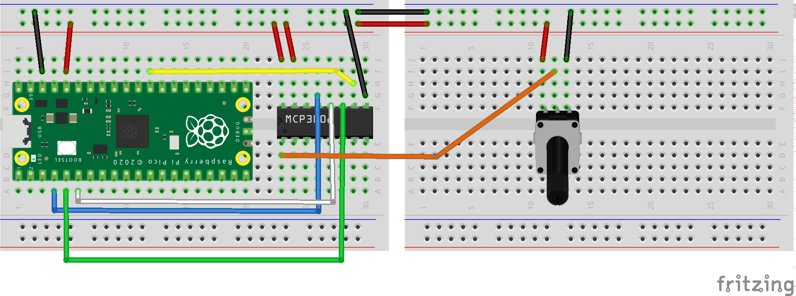

# MCP3008 8-channel ADC

I've ported and adapted Tony di Cola's CircuitPython code from Adafruit's GitHub repo for use with MicorPython.

It supports single-ended and differential mode on the [3008](https://www.adafruit.com/product/856).

I have no plans to support the 3002/3004 at present.

Here's the [fritzing](https://fritzing.org/) diagram for a test circuit with a potentiometer supplying a
variable voltage on analogue Channel 1:

[mcp3008-demo.py](../src/pico_code/pico/mcp3008-demo.py) contains the code for a simple demo using SPI channel 0.

    