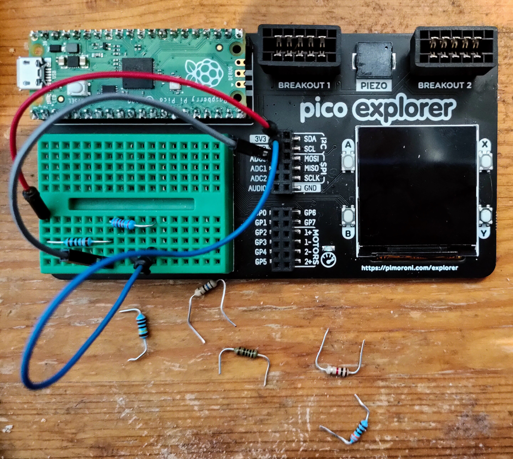

# Resistomatic

This is a crude but effective way of measuring an unknown resistance.

It applies 3.3 Volts across a voltage divider consisting of a known 1K ohm 1% resistor and the unknown resistor.



It uses ADC0 (GP26) to measure the voltage across the unknown resistor.

It then calculates the resistance and prints it.

If you start the program before you've inserted a resistor the program will either print a very high value which you 
can ignore or skip a divide-by-zero error and continue waiting for you to insert the resistor you want to test.

The code shown below is in `resistomatic/raw-resistance/py`

```python
import machine
import time

potentiometer = machine.ADC(26)


def run():
    while True:
        raw_v = potentiometer.read_u16()
        voltage = 3.3 * raw_v / 65535.0
        r_fixed = 1000 # Ohms
        try:
            r = r_fixed * voltage/(3.3 - voltage)
            print(r)
        except:
            pass
        time.sleep(1.0)
run()
```

At some time *real soon now*(tm) I'll add code to display the resistance and the corresponding colour code on 
the display of the explorer. For now, it just prints the results. You can read them on a connected host computer.