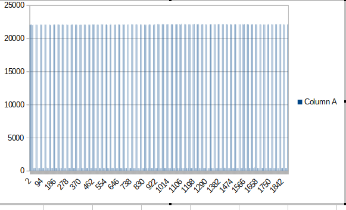

## Pico AF oscilloscope journal

There's been a lot of interest in an AF Oscilloscope based on the Raspberry Pi Pico.

That's my priority for this week, and I am going to try an experiment.

I will update this gist as I work, and tweet whenever there's something new to see.

### What's my MVP?

My Minimum Viable Product (MVP) is a demo of a software-based Oscilloscope that can display an audio frequency 
signal, showing the effect of changing the frequency and amplitude.

I'm going to capture the signal using one of the analogue inputs on the Pico and send the values using a USB link to 
a Raspberry Pi. The Pi will display  the output. That's the same architecture that I used for the Etch-a-sketch 
emulator.

My first step is to create a suitable signal source. There are lots of options, but I think the simplest one is to 
build a square wave generator using an NE555 IC.

I'll put the signal generator together and report!

### First baby step

I now have a working NE555 timer. At the moment it's just flashing an LED, but I can change the frequency using a 
potentiometer.

The NE555 requires at least a 5V supply, and I am taking that from the Vbus pin of the Pico.

The next step is to connect the square wave output to a variable voltage divider that keeps the output below 3V3 so 
it's within the allowable range of the PICO's analogue inputs.

## The scope is working (sorta)!

I can capture the Pico's output as a file and display it as a chart in a spreadhseet!

## Real time plotting

It works, but the display on a Pi 4 is very slow.

You can see sample output on YouTube: https://youtu.be/f1jW6j6FWHI

## Getting faster

I've sped things up a bit using `guizero`, but it's still so slow that it's just a fun proof of concept.

I think I'd have to implement the plotting in C to get realistic speeds.

The Pico will happily emit 1000 samples/sec using MicroPython code, and could probably go faster: *much* faster if 
the Pico app was coded in c.