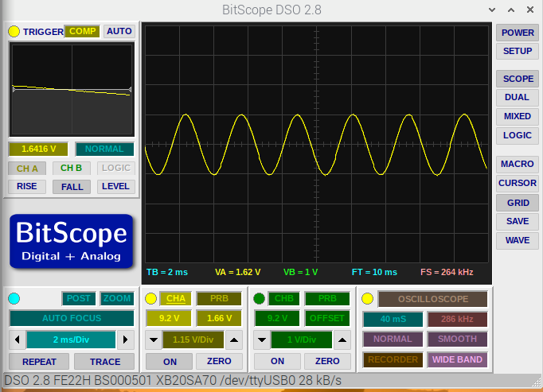

# fungen - AF Function Generator

This project is currently under active development. Expect the code and hardware to change!

I wanted a signal source to help me test the Pico-based Oscilloscope I'm working on, and this turned into
a project in its own right.

One of the great features of the Raspberry Pi Pico is its PIO (Programmable I/O) which allows you to control additional
on-chip processors that can handle GPIO input and output and output tasks without loading the main CPU.

The official Pico MicroPython code examples include an implementation of PWM (Pulse width modulation)and it's easy to
hack to code to produce a fast-changing PWM signal that you can use as the basis of a simple DAC (digital to analogue 
converter).

The `fungen` code uses a list of output values that correspond to a sine wave.

The rough sine wave is output using the fast PIO-based PWM and then passed though a very simple 
[low-pass filter](https://en.wikipedia.org/wiki/Low-pass_filter) to create a 
smooth analogue output. The filter consists of a resistor and capacitor: crude but effective!

Here's a picture of the Pico + filter.

Here's some sample output which is displayed on the Pi using a [bitscope micro]() to capture the signal.

